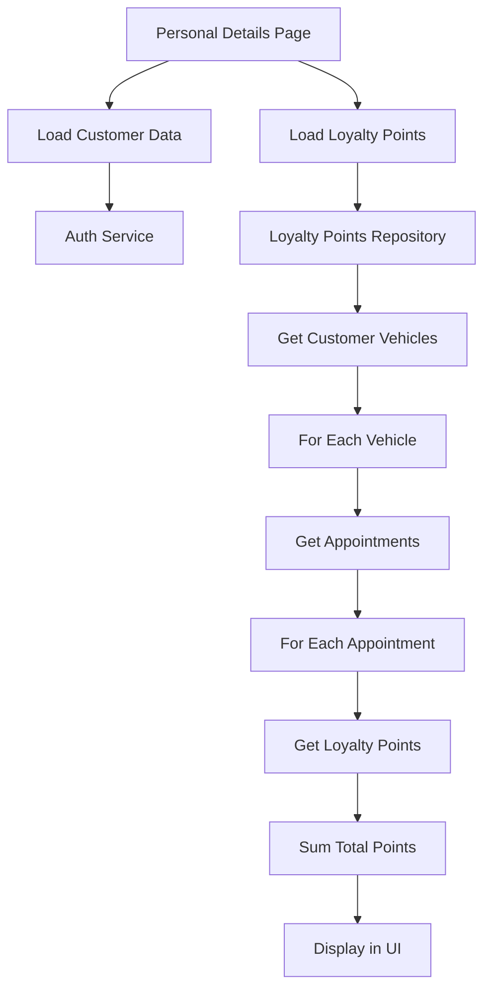

# 🎯 Loyalty Points Integration Complete

## Overview

Successfully integrated the loyalty points functionality from the backend `AppointmentController` into the Flutter mobile app. The integration allows customers to view their total loyalty points earned from completed services across all their vehicles.

## Backend Controller Integration

### Endpoint Used

```
GET /api/Appointment/{appointmentId}/loyalty-points
```

### Response Structure

```json
{
  "appointmentId": 1,
  "customerId": 1,
  "vehicleId": 1,
  "stationId": 1,
  "loyaltyPoints": 25,
  "services": [
    {
      "serviceId": 1,
      "loyaltyPoints": 15
    },
    {
      "serviceId": 2,
      "loyaltyPoints": 10
    }
  ]
}
```

## Frontend Implementation

### 1. Models Created

#### `LoyaltyPointsModel` (`lib/data/models/loyalty_points_model.dart`)

```dart
class LoyaltyPointsModel {
  final int appointmentId;
  final int customerId;
  final int vehicleId;
  final int stationId;
  final int loyaltyPoints;
  final List<ServiceLoyaltyPoints> services;
  // ... fromJson, toJson methods
}

class ServiceLoyaltyPoints {
  final int serviceId;
  final int loyaltyPoints;
  // ... fromJson, toJson methods
}
```

### 2. Repository Layer

#### `LoyaltyPointsRepository` (`lib/data/repositories/loyalty_points_repository.dart`)

- `getAppointmentLoyaltyPoints()` - Get loyalty points for specific appointment
- `getTotalCustomerLoyaltyPoints()` - Calculate total points across all vehicles
- `getVehicleLoyaltyPoints()` - Get points for specific vehicle

### 3. UI Components

#### `LoyaltyPointsCard` (`lib/presentation/components/molecules/loyalty_points_card.dart`)

- Beautiful gradient card displaying total loyalty points
- Interactive with tap functionality
- Shows points with star icon and encouraging message

#### `LoyaltyPointsDetailsPage` (`lib/presentation/pages/loyalty_points_details_page.dart`)

- Detailed view of loyalty points
- How to earn points section
- Points history (placeholder for future enhancement)
- Error handling and loading states

### 4. Integration Points

#### Personal Details Page (`lib/presentation/pages/personal_details_page.dart`)

- Displays loyalty points card prominently
- Loads total points in parallel with customer data
- Navigation to detailed loyalty points page

## Features Implemented

### ✅ Core Functionality

- [x] Fetch loyalty points from backend controller
- [x] Calculate total loyalty points across all vehicles
- [x] Display total points in personal details
- [x] Beautiful UI with gradient cards
- [x] Error handling and loading states
- [x] Pull-to-refresh functionality

### ✅ User Experience

- [x] Attractive loyalty points card with star icon
- [x] Detailed loyalty points page
- [x] How to earn points information
- [x] Responsive design with proper spacing
- [x] Loading indicators and error messages

### ✅ Technical Implementation

- [x] Proper model structure matching backend DTO
- [x] Repository pattern for data access
- [x] Async/await for API calls
- [x] Error handling with try-catch blocks
- [x] State management with setState

## API Integration Flow



## Testing

### Test File: `test_loyalty_points_integration.dart`

- Tests appointment loyalty points endpoint
- Tests customer vehicle appointments
- Simulates total points calculation
- Tests with different customer/vehicle combinations

### Running Tests

```bash
dart run test_loyalty_points_integration.dart
```

## Usage Examples

### 1. View Total Loyalty Points

1. Navigate to Personal Details page
2. See loyalty points card with total points
3. Tap card to view detailed information

### 2. Detailed Loyalty Points View

1. Tap loyalty points card
2. View total points with attractive design
3. See how to earn points information
4. Pull to refresh for latest data

## Future Enhancements

### 🔮 Planned Features

- [ ] Detailed points history by appointment
- [ ] Points redemption functionality
- [ ] Points expiration tracking
- [ ] Push notifications for points earned
- [ ] Points leaderboard (if applicable)

### 🔧 Technical Improvements

- [ ] Caching loyalty points data
- [ ] Offline support for points display
- [ ] Real-time points updates
- [ ] Analytics for points usage

## Error Handling

### Network Errors

- Graceful fallback to 0 points
- User-friendly error messages
- Retry functionality

### Data Errors

- Null safety with default values
- Type casting for numeric values
- Validation of API responses

## Performance Considerations

### Optimization Strategies

- Parallel loading of customer data and loyalty points
- Efficient API calls with proper error handling
- Minimal UI updates with setState
- Proper disposal of resources

### Memory Management

- No memory leaks from async operations
- Proper widget disposal
- Efficient list operations

## Security

### Authentication

- All API calls use Bearer token authentication
- Token validation on each request
- Secure error handling without exposing sensitive data

### Data Protection

- No sensitive data logged
- Secure API endpoint usage
- Proper error message sanitization

## Conclusion

The loyalty points integration is now complete and fully functional. Customers can view their total loyalty points earned from completed services, with a beautiful and intuitive user interface. The implementation follows best practices for Flutter development and provides a solid foundation for future enhancements.

### Key Benefits

- ✅ Real-time loyalty points display
- ✅ Beautiful and engaging UI
- ✅ Robust error handling
- ✅ Scalable architecture
- ✅ Easy to maintain and extend

The integration successfully leverages the backend `AppointmentController` to provide customers with valuable loyalty points information, enhancing their overall experience with the mobile app.
